# ZJU-blockchain-course-2024

作业提交方式为：**提交视频文件**和**仓库的链接**到指定邮箱。

## 如何运行

### 合约

1. 在本地启动ganache应用，设置端口为 8545。

2. 在 `./contracts` 中安装需要的依赖，运行如下的命令：
    ```bash
    npm install
    ```
    
3. 在 `./contracts` 中编译合约，运行如下的命令：
    ```bash
    npx hardhat compile
    ```
    
4. 修改 hardhat.config.ts，添加 ganache 网络：

    ```
    networks: {
        ganache: {
          // rpc url, change it according to your ganache configuration
          url: 'http://127.0.0.1:8545',
          accounts: [
          	// your accounts
          ]
       },
     }
    ```

6. 部署合约到 ganache 网络中：
   
    ```
    npx hardhat run .\scripts\deploy.ts --network ganache
    ```
    
6. 复制得到链的地址，然后粘贴到 `./frontend/src/utils/contract-addresses.json` 中
   
    ```
    {
      "BMR": your address，
      "myERC20": your address
    }
    ```
    
7. 复制 `./contracts/artifacts/contracts/BuyMyRoom.sol/BuyMyRoom.json` 文件和  `./contracts/artifacts/contracts/BuyMyRoom.sol/MyERC20.json`，将其粘贴到 `./frontend/src/utils/abis` 文件夹中。

### 前端

1. 在 `./frontend` 中安装需要的依赖，运行如下的命令：

    ```bash
    npm install
    ```

2. 在 `./frontend` 中启动前端程序，运行如下的命令：
    ```bash
    npm run start
    ```

## 功能实现分析

### 发行房屋与领取房屋

- 项目支持合约发行房屋，每个 NFT 代表一栋房屋。同时用户可以免费领域两个房屋 NFT。

- Solidity

  ```solidity
  // House Struct
  struct House {
      address owner; // 房屋拥有者
      uint256 tokenId; // 房屋的 tokenId
      bool isListed; // 房屋是否挂单销售
      uint256 listedStartTimestamp; // 房屋的挂单开始时间
      uint256 price; // 房屋的价格
      bool token; // 使用 ETH 还是 ERC20
  }
  
  // 设置 tokenId 与 具体房屋的对应关系
  mapping(uint256 => House) public houses;
  
  // 设置已领取用户状态，已领取过房屋的用户不能重复领取
  mapping(address => bool) public initUsers;
  
  // 发行房屋，并分配给指定的地址
  function mint(address to) internal {
      _safeMint(to, _tokenIdCounter);
      houses[_tokenIdCounter] = House(to, _tokenIdCounter, false, 0, 0);
      _tokenIdCounter++;
      console.log("Total houses: %s", _tokenIdCounter);
  }
  
  // 用户领取房屋，一次领取两个房屋
  function initUserHouse() external {
      require(!initUsers[msg.sender], "User already initialized");
      // mint 2 houses for user
      mint(msg.sender);
      mint(msg.sender);
      initUsers[msg.sender] = true; // 设置已领取房屋
      console.log("Initialized user: %s", msg.sender);
  }
  ```

- React

  ```js
  const onGetInitHouse = async () => {
      if(account === '') {
          alert('You have not connected wallet yet.')
          return
      }
      if (BMR_Contract) {
          try {
              // 首先查看本账号是否已经领取房屋
              const result = await BMR_Contract.methods.initUsers(account).call();
              setIsInit(result);
  			
              // 如果已经领取，则直接返回
              if (result) {
                  alert('You have already got the initial house.')
                  return
              }
              // 若没领取，则初始化自己的房屋
              await BMR_Contract.methods.initUserHouse().send({
                  from: account
              })
              // 同时初始化自己的房屋信息
              const hs = await BMR_Contract.methods.getMyHouses().call({
                  from: account
              })
              // 更新状态
              updateMyHouses(draft => {
                  draft.length = 0
                  draft.push(...hs)
              })
              setIsInit(true)
  
              alert("You have got the initial house.")
          } catch (error: any) {
              alert(error.message)
          }
      } else {
          alert('Contract not exists.')
      }
  }
  ```

### 兑换代币（Bonus）

- 支持用户使用 ETH 兑换 ERC20 代币，目前是 1：1的兑换比例

- Solidity

  ```solidity
  contract MyERC20 is ERC20 {
      constructor() ERC20("MyERC20", "ME2") {
      }
      // 兑换代币
      function exchangeERC20() external payable {
          uint256 amount = msg.value / 1 ether; // 1 token per ETH
          _mint(msg.sender, amount);
      }
  }
  ```

- React

  ```js
  const onExchangeERC20 = async (num: number) => {
      if(account === '') {
          alert('You have not connected wallet yet.')
          return
      }
      if (myERC20Contract) {
          try {
              // 1 ETH 兑换 1 个 ERC20 代币
              const n = web3.utils.toWei(num.toString(), 'ether') // 1 eth for 1 erc20
              // 申请兑换
              await myERC20Contract.methods.exchangeERC20().send({
                  from: account,
                  value: n
              })
  			// 更新信息
              updateInfo()
              alert('You have exchanged the house.')
          } catch (error: any) {
              alert(error.message)
          }
      } else {
          alert('Contract not exists.')
      }
  }
  ```

### 查看自己拥有的房产列表

- 项目支持用户查看自己所拥有的房产列表

- Solidity

  ```solidity
  // 查看用户自己的房产
  function getMyHouses() external view returns(House[] memory) {
      uint256 balance = balanceOf(msg.sender); // 得到用户房产的数量
      House[] memory myHouses = new House[](balance); // 使用房产数量初始化房产数组
      if (balance == 0) {
          return myHouses;
      }
      // 遍历所有房产，储存用户自己的房产
      uint256 j = 0;
      for (uint256 i=0; i < _tokenIdCounter; i++) {
          if (ownerOf(i) == msg.sender) {
              myHouses[j] = houses[i];
              j++;
          }
      }
      return myHouses;
  }
  ```

- React

  ```js
  const onGetMyHouse = async () => {
      if(account === '') {
          alert('You have not connected wallet yet.')
          return
      }
      if (BMR_Contract) {
          try {
              // 得到自己的房产列表
              const hs = await BMR_Contract.methods.getMyHouses().call({
                  from: account
              })
              // 更新房产
              updateMyHouses(draft => {
                  draft.length = 0
                  draft.push(...hs)
              })
          } catch (error: any) {
              alert(error.message)
          }
      } else {
          alert('Contract not exists.')
      }
  }
  ```

### 挂单出售房产与取消挂单

- 项目支持用户挂单出售自己的房产，同时也支持用户取消挂单

- Solidity

  ```solidity
  // 挂单出售房产，输入为房产的 tokenId 和挂单价格（Wei）
  function listHouse(uint256 tokenId, uint256 price, bool token) external returns (House memory) {
      require(ownerOf(tokenId) == msg.sender, "You are not the owner of this house");
      require(houses[tokenId].owner != address(0), "House does not exist");
      require(price > 0, "Price must be greater than 0");
      require(!houses[tokenId].isListed, "House is already listed");
      // 设置挂单出售
      houses[tokenId].isListed = true;
      houses[tokenId].price = price;
      houses[tokenId].token = token;
      houses[tokenId].listedStartTimestamp = block.timestamp;
      emit HouseListed(tokenId, price, msg.sender);
      return houses[tokenId];
  }
  // 取消挂单出售房产
  function unListHouse(uint256 tokenId) external returns (House memory) {
      require(ownerOf(tokenId) == msg.sender, "You are not the owner of this house");
      require(houses[tokenId].isListed, "House is not listed");
      // 设置取消挂单
      houses[tokenId].isListed = false;
      houses[tokenId].price = 0;
      houses[tokenId].token = false;
      houses[tokenId].listedStartTimestamp = 0;
      emit HouseUnlisted(tokenId);
      return houses[tokenId];
  }
  ```

- React

  ```js
  const onListHouse = async (tokenId:number, price: number) => {
      if(account === '') {
          alert('You have not connected wallet yet.')
          return
      }
      if (BMR_Contract) {
          try {
              if (token) { // 如果是 ERC20
                  await BMR_Contract.methods.listHouse(tokenId, price, token).send({
                      from: account
                  })
              } 
              else{ // 如果是 ETH
                  // 将 ETH 转化成 Wei
                  const wei_price = web3.utils.toWei(price.toString(), 'ether')
                  await BMR_Contract.methods.listHouse(tokenId, wei_price, token).send({
                      from: account
                  })
              }
              // 更新 house 和 listing house 的状态
              updateInfo()
              alert('You have listed the house.')
          } catch (error: any) {
              alert(error.message)
          }
      } else {
          alert('Contract not exists.')
      }
  }
  const onUnListHouse = async (tokenId:number) => {
      if(account === '') {
          alert('You have not connected wallet yet.')
          return
      }
      if (BMR_Contract) {
          try {
              // 取消挂单
              await BMR_Contract.methods.unListHouse(tokenId).send({
                  from: account
              })
       		// 更新 houses 和 listing houses 的状态
              updateInfo()
              alert('You have unlisted the house.')
          } catch (error: any) {
              alert(error.message)
          }
      } else {
          alert('Contract not exists.')
      }
  }
  ```

### 查询出售房产与查询主人、挂单等信息

- 项目支持用户查询所有出售的房产，并能够点击相应的房产后，显示该房产的主人，以及其他的挂单房产信息。

- Solidity

  ```solidity
  // 查询所有的出售房产
  function getTotalListingHouses() external view returns(House[] memory) {
  	// 得到所有出售房产的数量
      uint256 listNum = 0;
      for (uint256 i=0; i < _tokenIdCounter; i++) {
          if (houses[i].isListed) {
              listNum++;
          }
      }
      // 初始化数组，并遍历所有出售房产，进行赋值
      House[] memory listingHouses = new House[](listNum);
      uint256 j = 0;
      for (uint256 i=0; i < _tokenIdCounter; i++) {
          if (houses[i].isListed) {
              listingHouses[j] = houses[i];
              j++;
          }
      }
      return listingHouses;
  }
  ```

- React

  ```js
  const onGetTotalListingHouses = async () => {
      if(account === '') {
          alert('You have not connected wallet yet.')
          return
      }
      if (BMR_Contract) {
          try {
              // 得到所有的出售房产
              const lhs = await BMR_Contract.methods.getTotalListingHouses().call({
                  from: account
              })
              // 更新 listing houses 的状态
              updateListingHouses(draft => {
                  draft.length = 0
                  draft.push(...lhs)
              })
          } catch (error: any) {
              alert(error.message)
          }
      } else {
          alert('Contract not exists.')
      }
  }
  
  // 显示挂单房屋的主人以及其挂单房屋的信息
  <Modal title="查询信息" open={isQueryModalOpen} onOk={handleQueryCancel} onCancel={handleQueryCancel}>
      <p>户主：{selectedHouse?.owner}</p> 
      <p>户主出售的房产：</p>
      {listingHouses.map((h: any, index: number) => {
          if (selectedHouse?.owner === h.owner) {
              return <p>房屋ID： {h?.tokenId}</p>
          }
          else {
              return <> </>
          }
      })}
  </Modal>
  ```

### 用户购买房产与平台收取手续费

- 项目支持用户购买房产，购买房产时，平台会收取部分手续费。购买房产后，房屋所有权会进行转移。

- Solidity

  ```solidity
  // 用户使用 ETH 购买房产，tokenId 为购买房产的 Id，用户传递价格到 msg.value 中进行交易
  function buyHouse(uint256 tokenId) external payable returns (House memory) {
      require(houses[tokenId].isListed, "House is not listed");
      require(houses[tokenId].price > 0 && houses[tokenId].listedStartTimestamp > 0, "House price and listedStartTimestamp need to be bigger than 0");
      require(ownerOf(tokenId) != msg.sender, "You are the owner of this house");
      require(msg.value >= houses[tokenId].price, "Insufficient funds");
      // 得到房产的原主人，挂单价格和挂单时长
      address owner = houses[tokenId].owner;
      uint256 price = houses[tokenId].price;
      uint256 listingTimestamp = block.timestamp - houses[tokenId].listedStartTimestamp;
      // 计算手续费，手续费为挂单价格的百分之一乘以挂单时长（按分钟计时）
      uint256 fee = listingTimestamp / 60 * price * feeRate / 100;
      // 设置最大手续费
      uint256 maxFee = price * feeRate * 20 / 100;
      if (fee > maxFee) {
          fee = maxFee;
      }
      // 支付 ETH
      payable(platform).transfer(fee);
      payable(owner).transfer(price - fee);
      // 房产所有权转移
      _transfer(owner, msg.sender, tokenId);
      // 更新房产信息
      houses[tokenId].owner = msg.sender;
      houses[tokenId].isListed = false;
      houses[tokenId].price = 0;
      houses[tokenId].listedStartTimestamp = 0;
      emit HouseBought(tokenId, price / 1 ether, msg.sender);
      return houses[tokenId];
  }
  // 用户使用 ERC20 购买房产，tokenId 为购买房产的 Id
  function buyHouseByERC20(uint256 tokenId) external payable returns (House memory) {
      require(houses[tokenId].isListed, "House is not listed");
      require(houses[tokenId].price > 0 && houses[tokenId].listedStartTimestamp > 0, "House price and listedStartTimestamp need to be bigger than 0");
      require(ownerOf(tokenId) != msg.sender, "You are the owner of this house");
  	
      address owner = houses[tokenId].owner;
      uint256 price = houses[tokenId].price;
      // 检测用户 ERC20 是否满足价格
      require(myERC20.balanceOf(msg.sender) >= price, "Insufficient ERC20 balance");
      // 支付 ERC20
      myERC20.transferFrom(msg.sender, owner, price);
  	// 房产所有权转移
      _transfer(owner, msg.sender, tokenId);
      houses[tokenId].owner = msg.sender;
      houses[tokenId].isListed = false;
      houses[tokenId].price = 0;
      houses[tokenId].token = false;
      houses[tokenId].listedStartTimestamp = 0;
      emit HouseBought(tokenId, price, msg.sender);
      return houses[tokenId];
  }
  ```

- React

  ```js
  const onBuyHouse = async (tokenId: number, price: number, token: boolean) => {
      if(account === '') {
          alert('You have not connected wallet yet.')
          return
      }
      if (BMR_Contract) {
          try {
              if (token) { // 如果使用 ERC 20 购买
                  // 对转移的代币数量进行授权
                  await myERC20Contract.methods.approve(BMR_Contract.options.address, price).send({
                      from: account
                  })
                  // 购买房屋
                  await BMR_Contract.methods.buyHouseByERC20(tokenId).send({
                      from: account
                  })
              }
              else{ // 如果使用 ETH 购买
                  // 购买房屋
                  await BMR_Contract.methods.buyHouse(tokenId).send({
                      from: account,
                      value: price
                  })
              }
              // 更新信息
              updateInfo()
              alert('You have bought the house.')
          } catch (error: any) {
              alert(error.message)
          }
      } else {
          alert('Contract not exists.')
      }
  }
  ```


## 项目运行截图

### 连接账号与初始化

- 连接账号界面，输入密码，登录 MetaMask。

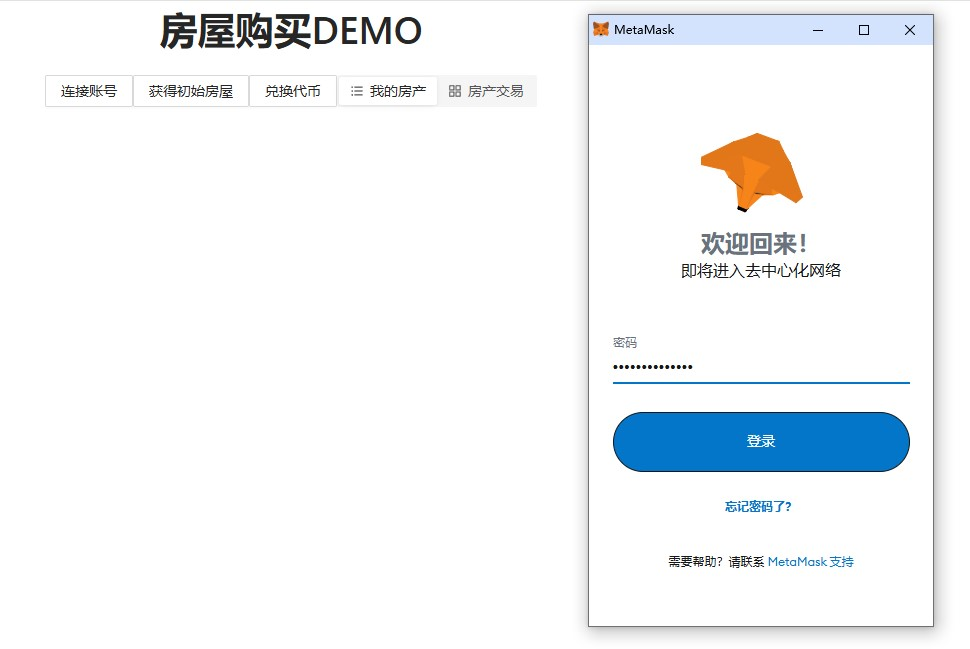

- 领取初始房屋界面。MetaMaster 会弹出交易请求，之后涉及到改变链的操作时（send），均会弹出该交易请求，所以在之后中不再进行截图。

  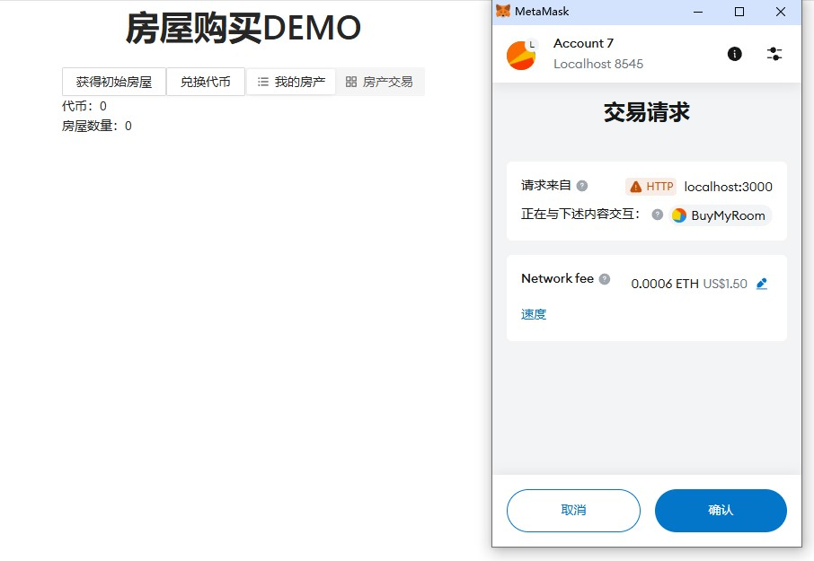

- 我的房产界面。当领取房屋或购买其他人房屋后，房产便会显示在我的房产界面。此时领取的房屋还是未上架的状态。

  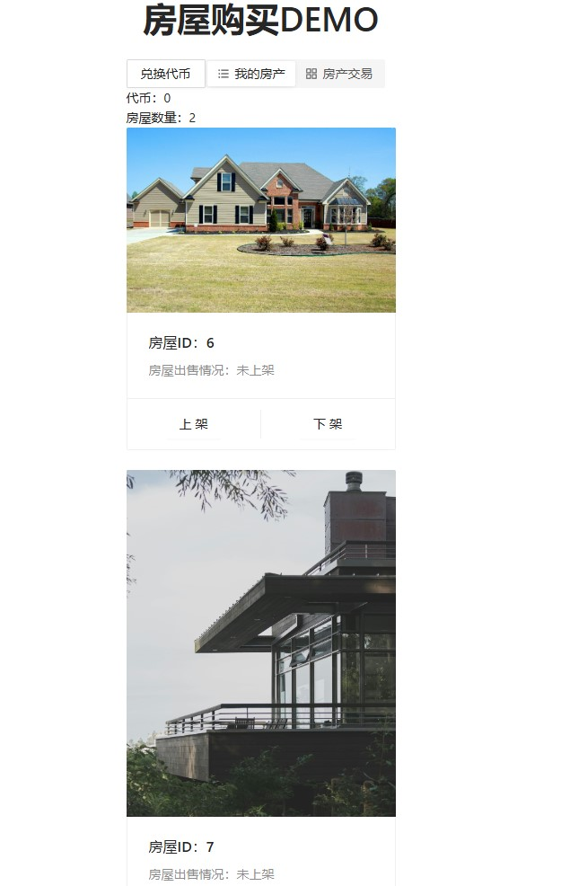

### 兑换代币

- 兑换代币界面。输入兑换数量，点击兑换，即可完成兑换。然后可以在“代币”处查看自己的代币数量。

  
### 挂单房产并出售

- 对房屋ID 为 6 的房产，点击上架后，设置出售金额为 5 ERC20。当然也可以选择 ETH 进行出售。

  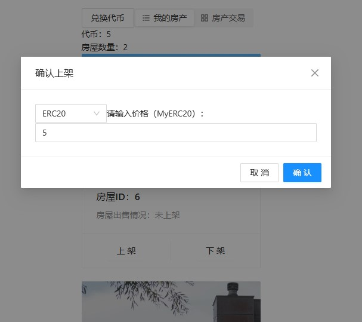

- 然后点击房产交易，可以看到我们的房产已经挂单出售了。可以在房产处看到房屋ID，房屋价格（ETH 或 ERC20）和挂单时间。

  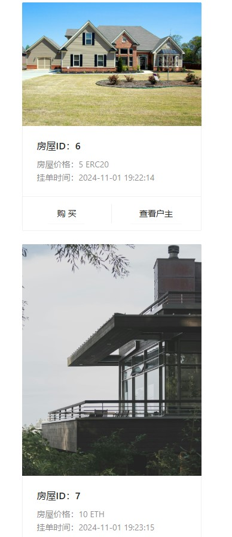

### 查询房产主人与挂单信息

- 我们点击房屋ID 为 4 的房产查看户主信息，可以看到户主的地址与其挂单的所有房产。

  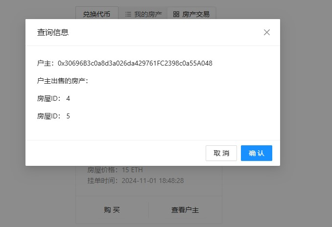

### 购买房产

- 我们此时使用的是 Account 6，我们查看钱包或者 ganache，来查看所有账户的余额信息，此时我们准备购买房屋ID 为 4 的房产，其属于 Account 3。

  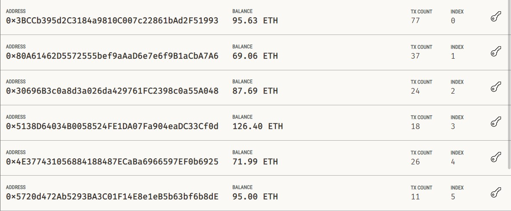

- 我们点击购买房屋ID 为 4 的房产，并确认购买。

  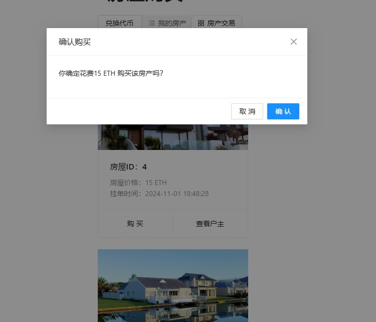

- 购买完成后，可以发现账户余额发生了变化。由于 Ganache 默认部署合约的用户是 Account 1 ，所以我们的手续费会被转移到 Account 1中，所以 Account 1 的余额增加了一部分。而 Account 6 的余额减少了 15 ETH，Account 3 的余额增加了 15 ETH 减去手续费的部分。

  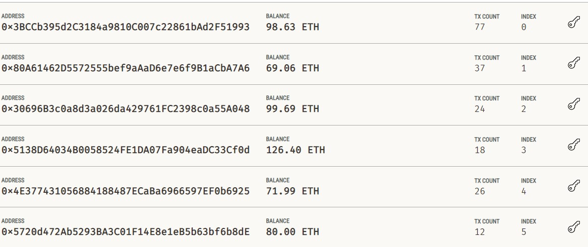

- 此时查看我的房产，可以看到房产已经发生了转移。

  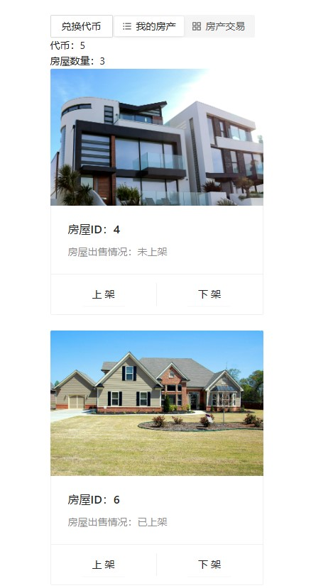

- 钱包如图所示，可见也一同发生了变化。

  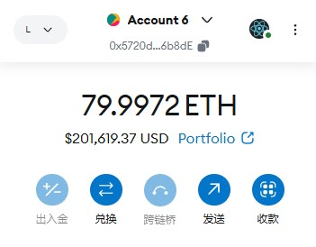

### 使用代币购买

- 除了 ETH 外，我们也可以通过 ERC20 代币进行购买，此时 ERC20 代币会发生转移。
    
  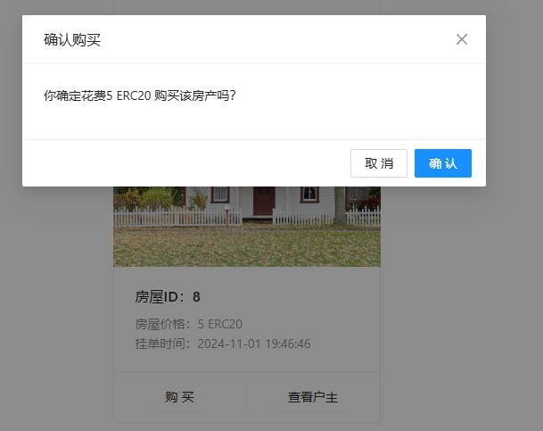


## 参考内容

- 课程的参考Demo见：[DEMOs](https://github.com/LBruyne/blockchain-course-demos)。
- 代码框架参考：[blockchain-course-demos/demo-lottery-application at master · LBruyne/blockchain-course-demos](https://github.com/LBruyne/blockchain-course-demos/tree/master/demo-lottery-application)
- 快速实现 ERC721 和 ERC20：[模版](https://wizard.openzeppelin.com/#erc20)。记得安装相关依赖 ``"@openzeppelin/contracts": "^5.0.0"``。
- 如何实现ETH和ERC20的兑换？ [参考讲解](https://www.wtf.academy/en/docs/solidity-103/DEX/)
